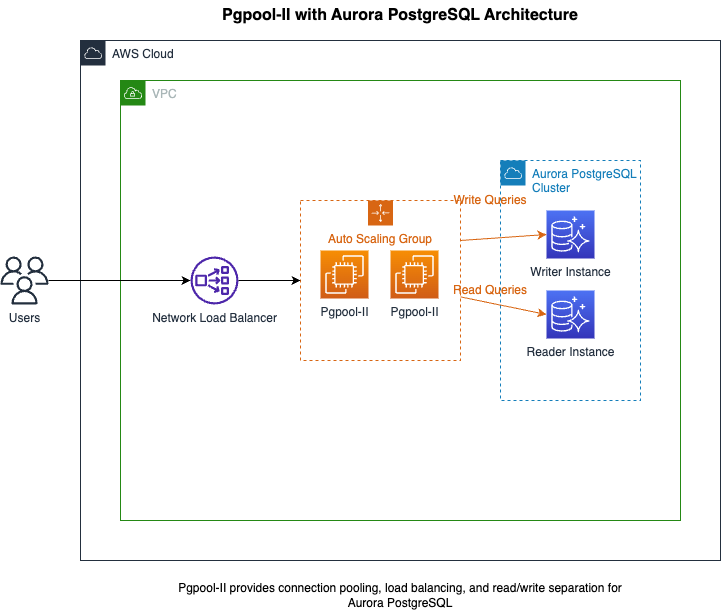

# Pgpool-II Aurora PostgreSQL CDK部署指南

本文档提供了使用AWS CDK部署Pgpool-II与Aurora PostgreSQL高可用架构的详细步骤。这是项目的CDK部署部分，关于整体项目架构和AMI创建，请参考[根目录README](../README.md)。

## 架构概述



该架构提供以下功能：
- 高可用性：通过在多个可用区部署Pgpool-II实例和Aurora节点
- 负载均衡：Pgpool-II提供连接池和负载均衡功能
- 自动扩展：根据负载自动调整Pgpool-II实例数量
- 健康检查：使用pgdoctor监控Pgpool-II实例健康状态

## 网络配置详情

当不指定VPC和子网参数时，CDK会自动创建和配置网络资源：

### 默认VPC和子网配置

1. **VPC创建**：
   - 当不提供`vpc_id`参数时，CDK会创建一个新的VPC
   - 默认CIDR通常为10.0.0.0/16

2. **子网配置**：
   - 在每个可用区创建2种类型的子网：公有子网和私有子网
   - 通常使用账户中可用的所有可用区（一般为3个可用区）
   - 默认情况下会创建6个子网（3个公有 + 3个私有）

3. **NAT网关**：
   - 在每个公有子网中创建一个NAT网关
   - 私有子网通过NAT网关访问互联网

### 组件部署位置

1. **NLB部署**：
   - 默认部署在公有子网中
   - 用户不需要明确选择public或private
   - 如需内部NLB（不可从互联网访问），需在代码中明确指定`internet_facing=False`

2. **Pgpool-II实例**：
   - 默认部署在私有子网中
   - 通过Auto Scaling Group跨多个可用区部署
   - 实例可以通过NAT网关访问互联网进行更新

3. **Aurora PostgreSQL**：
   - 默认部署在私有子网中
   - 写入节点和读取节点分布在不同可用区的私有子网中
   - 不需要直接访问互联网

### 自定义网络配置

如果需要更精细地控制网络配置，建议：

1. **使用现有VPC和子网**：
   ```bash
   cdk deploy -c ami_id=ami-xxx -c vpc_id=vpc-xxx -c subnet_ids=subnet-1,subnet-2,subnet-3
   ```

2. **遵循最佳实践**：
   - Pgpool-II实例应部署在私有子网中
   - NLB根据访问需求部署在公有或私有子网中
   - Aurora集群应部署在私有或隔离子网中

## 前提条件

1. 已创建包含pgpool和pgdoctor的AMI（使用`create_pgpool_AMI.py`脚本）
2. 安装了AWS CDK CLI
3. 配置了AWS凭证

## 获取和准备项目

### 1. 获取项目代码

如果您还没有获取项目代码，可以通过以下方式获取：

```bash
# 使用Git克隆
git clone https://github.com/wangyunzhang/pgpool-cluster-auto.git
cd pgpool-cluster-auto/pgpool_aurora_cdk

# 或者，如果您已下载并解压ZIP文件
cd pgpool-cluster-auto-main/pgpool_aurora_cdk
```

### 2. 安装依赖

```bash
# 创建并激活虚拟环境
python -m venv .venv
source .venv/bin/activate

# 安装依赖
pip install -r requirements.txt

# 安装AWS CDK CLI（如果尚未安装）
npm install -g aws-cdk
```

### 3. 初始化CDK环境（首次使用）

首先，检查是否已在目标区域初始化CDK环境：

```bash
aws cloudformation describe-stacks --stack-name CDKToolkit
```

如果命令返回错误"Stack with id CDKToolkit does not exist"，则表示需要执行初始化。

如果是首次在AWS账户/区域使用CDK，需要执行bootstrap命令：

```bash
cdk bootstrap aws://ACCOUNT-NUMBER/REGION
```

替换`ACCOUNT-NUMBER`为您的AWS账户ID，`REGION`为您要部署的区域。

bootstrap过程会在您的账户中创建必要的资源，包括S3存储桶和IAM角色，以支持CDK部署。这是一次性操作，每个区域只需执行一次。

### 4. 配置参数

可以通过CDK上下文参数配置部署选项：

```bash
cdk deploy -c ami_id=ami-xxxxxxxxxx \
           -c vpc_id=vpc-xxxxxxxxxx \
           -c subnet_ids=subnet-xxxx,subnet-yyyy,subnet-zzzz \
           -c instance_type=t3.medium \
           -c disk_size=20 \
           -c min_capacity=2 \
           -c max_capacity=4 \
           -c desired_capacity=2 \
           -c db_instance_class=db.t3.medium \
           -c db_replica_count=1
```

### 5. 部署前验证

在执行部署前，可以使用以下命令查看将要创建的资源：

```bash
cdk diff -c ami_id=ami-xxxxxxxxxx [其他参数]
```

这将显示CloudFormation将要执行的变更，但不会实际部署资源。

### 参数说明

| 参数 | 描述 | 默认值 | 是否必需 |
|------|------|--------|----------|
| ami_id | Pgpool-II AMI ID | - | 是 |
| vpc_id | 现有VPC ID | - | 否，不提供将创建新VPC |
| subnet_ids | 子网ID列表，逗号分隔 | - | 否，不提供将使用VPC默认子网 |
| instance_type | Pgpool-II实例类型 | t3.medium | 否 |
| disk_size | Pgpool-II实例磁盘大小(GB) | 20 | 否 |
| min_capacity | Auto Scaling Group最小容量 | 2 | 否 |
| max_capacity | Auto Scaling Group最大容量 | 4 | 否 |
| desired_capacity | Auto Scaling Group期望容量 | 2 | 否 |
| db_instance_class | Aurora实例类型 | db.t3.medium | 否 |
| db_replica_count | Aurora只读副本数量 | 1 | 否 |

### 6. 执行部署

执行以下命令开始部署：

```bash
cdk deploy -c ami_id=ami-xxxxxxxxxx [其他参数]
```

部署过程中，CDK会显示将要创建的IAM权限，需要确认后继续。

### 7. 部署输出

部署成功后，CDK会输出重要的资源信息：

- **NLBEndpoint**: 网络负载均衡器端点，用于连接Pgpool
- **AuroraClusterEndpoint**: Aurora集群写入端点
- **AuroraReaderEndpoint**: Aurora集群读取端点
- **DatabaseSecretArn**: 数据库凭证密钥ARN

这些输出值可以在AWS控制台的CloudFormation服务中查看，或通过以下命令获取：

```bash
aws cloudformation describe-stacks --stack-name PgpoolAuroraStack --query "Stacks[0].Outputs"
```

## 部署后验证

部署完成后，您可以通过以下方式验证架构：

1. **连接到NLB端点**：
   ```bash
   psql -h <NLB_ENDPOINT> -p 5432 -U pdadmin -d postgres
   ```
   NLB端点可以从CloudFormation输出中获取。

2. **验证连接池和负载均衡功能**：
   在psql中执行以下查询，验证连接是否正常：
   ```sql
   SELECT current_database(), current_user;
   ```

3. **验证读写分离**：
   执行以下查询，观察是否在不同的节点上执行：
   ```sql
   -- 写入查询会路由到主节点
   CREATE TABLE test_table (id serial, name text);
   INSERT INTO test_table (name) VALUES ('test');
   
   -- 读取查询可能会路由到读取节点
   SELECT * FROM test_table;
   ```

4. **验证Auto Scaling**：
   可以通过AWS控制台监控Auto Scaling Group的状态，或者通过以下命令：
   ```bash
   aws autoscaling describe-auto-scaling-groups --auto-scaling-group-name <ASG_NAME>
   ```

5. **验证健康检查**：
   可以通过以下命令检查NLB目标组的健康状态：
   ```bash
   aws elbv2 describe-target-health --target-group-arn <TARGET_GROUP_ARN>
   ```

## 最佳实践

### 高可用性

1. **多可用区部署**：
   - 确保Pgpool-II实例部署在至少两个可用区
   - Aurora集群应跨多个可用区部署
   - 设置Auto Scaling Group的最小容量为2，确保始终有多个Pgpool实例运行

2. **故障转移配置**：
   - 配置适当的健康检查参数，确保快速检测故障
   - 设置合理的冷却时间，避免频繁的扩展和收缩

### 安全性

1. **数据加密**：
   - 使用密钥管理服务(KMS)加密Aurora数据
   - 启用传输中加密(SSL/TLS)

2. **访问控制**：
   - 实现精细的安全组规则，限制最小必要的访问
   - 使用Secrets Manager存储和轮换数据库凭证
   - 定期轮换数据库凭证，建议设置自动轮换

3. **网络隔离**：
   - 将Pgpool-II实例部署在私有子网中
   - 将Aurora集群部署在隔离子网中
   - 只允许必要的网络流量

4. **审计和日志**：
   - 启用Aurora审计日志
   - 配置CloudTrail跟踪API调用
   - 启用VPC流日志监控网络流量

### 监控

1. **CloudWatch告警**：
   - 设置CPU、内存和连接数的告警
   - 监控Aurora的复制延迟
   - 配置磁盘空间使用率告警

2. **通知机制**：
   - 配置SNS通知接收关键告警
   - 设置自动扩展事件通知

3. **仪表板**：
   - 创建综合性CloudWatch仪表板监控整个架构
   - 包括Pgpool实例、NLB和Aurora集群的关键指标

### 备份和恢复

1. **自动备份**：
   - 配置Aurora自动备份策略，默认保留期为7天
   - 考虑创建手动快照用于长期保留

2. **灾难恢复**：
   - 考虑使用跨区域备份
   - 定期测试恢复过程

3. **时间点恢复**：
   - 启用Aurora的时间点恢复功能
   - 记录关键变更的时间点，便于恢复

## 故障排除

### 连接问题

1. **无法连接到NLB端点**：
   - 检查安全组规则是否允许从您的IP地址到NLB的流量
   - 验证NLB健康检查配置是否正确
   - 检查目标组中是否有健康的目标

   ```bash
   # 检查目标组健康状态
   aws elbv2 describe-target-health --target-group-arn <TARGET_GROUP_ARN>
   
   # 检查Pgpool实例的状态
   aws ec2 describe-instance-status --instance-ids <INSTANCE_ID>
   ```

2. **Pgpool服务未运行**：
   - 连接到EC2实例并检查服务状态
   
   ```bash
   # 使用SSM连接到实例
   aws ssm start-session --target <INSTANCE_ID>
   
   # 检查服务状态
   sudo systemctl status pgpool
   sudo systemctl status pgdoctor
   
   # 检查日志
   sudo journalctl -u pgpool
   sudo journalctl -u pgdoctor
   ```

3. **数据库连接失败**：
   - 验证Secrets Manager中的凭证是否正确
   - 检查Aurora集群状态
   
   ```bash
   # 检查Aurora集群状态
   aws rds describe-db-clusters --db-cluster-identifier <CLUSTER_ID>
   
   # 获取数据库凭证
   aws secretsmanager get-secret-value --secret-id <SECRET_ARN> --query SecretString --output text
   ```

### 扩展问题

1. **Auto Scaling Group未正确扩展**：
   - 检查Auto Scaling Group配置
   - 查看CloudWatch指标和告警
   
   ```bash
   # 检查Auto Scaling Group配置
   aws autoscaling describe-auto-scaling-groups --auto-scaling-group-name <ASG_NAME>
   
   # 检查扩展策略
   aws autoscaling describe-policies --auto-scaling-group-name <ASG_NAME>
   ```

2. **启动模板问题**：
   - 检查启动模板配置
   - 验证AMI是否可用
   
   ```bash
   # 检查启动模板
   aws ec2 describe-launch-templates --launch-template-ids <TEMPLATE_ID>
   
   # 验证AMI状态
   aws ec2 describe-images --image-ids <AMI_ID>
   ```

### 更新和修改

1. **更新堆栈**：
   要更新已部署的堆栈，使用相同的`cdk deploy`命令，但更改参数值：
   
   ```bash
   cdk deploy -c ami_id=<NEW_AMI_ID> -c desired_capacity=4
   ```

2. **删除堆栈**：
   要删除所有资源，运行：
   
   ```bash
   cdk destroy
   ```
   
   注意：删除堆栈会删除所有相关资源，包括数据库。默认情况下，Aurora集群会创建最终快照。
